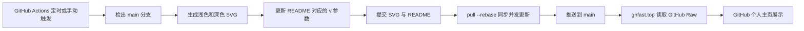

# 项目架构与维护说明

## 1. 项目目标

本仓库是 GitHub 个人主页仓库，核心目标是稳定展示以下内容：

- 打字动画；
- GitHub 连续提交统计；
- GitHub 资料奖杯；
- GitHub 贡献图贪吃蛇。

动态内容由 GitHub Actions 每日生成并提交到 `main` 分支。README 只引用仓库中已经生成的 SVG，避免用户打开主页时直接依赖第三方动态渲染服务。

所有图片通过 `ghfast.top` 代理访问，以改善中国大陆网络环境下 GitHub Raw 资源的可用性。动态图片 URL 同时携带自动变化的版本参数，用于规避 CDN、GitHub 图片代理和浏览器缓存。

## 2. 设计原则

1. **展示与生成解耦**：README 只负责展示，统计计算和 SVG 生成在 Actions 中完成。
2. **生成结果入库**：动态 SVG 提交到仓库，第三方服务短时故障不会立即导致主页图片消失。
3. **一类资源一个目录**：每个动态工作流只维护自己的 `profile-*` 目录。
4. **一类资源一个工作流**：工作流名称、生成目录和资源类型保持对应，便于手动执行和定位失败。
5. **明暗主题成对维护**：所有动态资源同时生成浅色与深色版本，由 README 的 `<picture>` 自动选择。
6. **通过 URL 版本规避缓存**：文件更新和 README 版本参数更新位于同一个提交中。
7. **失败不覆盖旧资源**：生成步骤成功后才进入提交阶段；失败时仓库中上一次成功生成的文件仍然可用。

## 3. 目录职责

```text
.
├─ .github/
│  └─ workflows/
│     ├─ profile-snake-contrib.yml   # 生成贡献图贪吃蛇
│     ├─ profile-streak-stats.yml     # 生成连续提交统计
│     └─ profile-trophy.yml           # 生成资料奖杯
├─ assets/
│  ├─ typing.svg                      # 浅色打字动画，静态资源
│  └─ typing-dark.svg                 # 深色打字动画，静态资源
├─ profile-snake-contrib/
│  ├─ github-contribution-grid-snake.svg
│  └─ github-contribution-grid-snake-dark.svg
├─ profile-streak-stats/
│  ├─ github-readme-streak-stats.svg
│  └─ github-readme-streak-stats-dark.svg
├─ profile-trophy/
│  ├─ github-profile-trophy.svg
│  └─ github-profile-trophy-dark.svg
├─ scripts/
│  └─ push.js                         # 本地提交和推送辅助脚本
├─ docs/
│  └─ architecture.md                 # 本文档
├─ package.json
└─ README.md                          # GitHub 个人主页展示入口
```

`profile-*` 目录中的 SVG 属于生成产物，不应手工修改。需要改变样式时，应修改对应工作流的生成参数，然后手动执行工作流验证结果。

## 4. 资源更新范围

| 资源 | 类型 | 更新方式 | README 缓存版本 |
| --- | --- | --- | --- |
| Typing | 静态 | 手工维护 | 固定为 `v=1`，内容变化时手工递增 |
| Streak Stats | 动态 | 每日工作流 | 每次运行自动更新 |
| Trophy | 动态 | 每日工作流 | 每次运行自动更新 |
| Snake Contrib | 动态 | 每日工作流 | 每次运行自动更新 |

三个动态工作流均支持 `workflow_dispatch`，可以在 GitHub Actions 页面中手动执行。

## 5. 总体数据流



文件内容变化并不能保证 CDN 立即刷新，因此工作流还会把对应 URL 的版本更新为：

```text
${GITHUB_RUN_ID}-${GITHUB_RUN_ATTEMPT}
```

同一次运行中的浅色、深色和 `` 回退地址使用相同版本号。每次运行都会形成新 URL，从而绕过已有缓存。

## 6. 工作流公共约定

三个工作流遵循相同的运行约定：

- 定时表达式：`0 0 * * *`；
- UTC 执行时间：每天 `00:00`；
- 北京时间：每天 `08:00`；
- Runner：`ubuntu-latest`；
- Job 超时：`5` 分钟；
- 权限：`contents: write`；
- 支持在 Actions 页面手动触发；
- 生成后直接提交到默认分支 `main`。

GitHub 的定时任务不保证精确到分钟，高峰时可能延迟。定时工作流只有位于默认分支时才会自动执行。

### 6.1 并发推送处理

三个工作流在相同时间触发，可能先后尝试更新 `main`。每个工作流在推送前执行：

1. 创建只包含本类 SVG 和对应 README 缓存版本的提交；
2. 执行 `git pull --rebase origin main`；
3. 尝试推送；
4. 推送失败时等待后重试，最多三次。

每个工作流修改不同的资源目录和 README 区段，正常情况下 rebase 可以自动合并。若 README 结构被大幅调整，可能发生冲突，需要手动执行失败的工作流。

工作流使用 `GITHUB_TOKEN` 推送。这类提交默认不会再次触发由 `push` 事件监听的工作流，可避免递归运行。

## 7. 各资源实现

### 7.1 Typing

Typing SVG 位于 `assets`，不经过工作流生成。README 中的 URL 使用固定缓存版本 `v=1`。

修改 Typing SVG 后必须同步递增 README 中浅色、深色和回退地址的 `v` 值，否则代理可能继续返回旧内容。

### 7.2 Streak Stats

工作流：`.github/workflows/profile-streak-stats.yml`

生成器使用 `DenverCoder1/github-readme-streak-stats`，当前固定到明确的提交 SHA，避免上游分支变更直接影响每日任务。

生成内容：

- 默认主题浅色 SVG；
- `ads-juicy-fresh` 主题深色 SVG；
- 关闭 SVG 动画，减少动态渲染差异和文件变化。

该生成器在 Actions 内读取 GitHub 数据并直接生成本地 SVG，主页加载时不访问公开 Streak Stats 服务。

### 7.3 Trophy

工作流：`.github/workflows/profile-trophy.yml`

奖杯服务没有稳定的官方公共端点，因此生成阶段依次尝试多个镜像：

1. `trophygithubreadmelang.cybee.dpdns.org`；
2. `trophy.benkou.dev`；
3. `github-trophies.devomb.com`。

下载逻辑包含以下保护：

- 连接超时和总超时；
- 单个镜像自动重试；
- 只接受包含 `<svg` 的响应；
- 当前镜像失败后自动切换下一个镜像；
- 所有镜像失败时终止工作流，不提交无效文件。

奖杯当前显示一行四列，过滤未知等级，并分别使用 `flat` 和 `juicyfresh` 主题。

### 7.4 Snake Contrib

工作流：`.github/workflows/profile-snake-contrib.yml`

生成器使用 `Platane/snk/svg-only@v3`，根据仓库所有者的 GitHub 贡献图生成浅色和 GitHub 深色调色板版本。

该工作流只负责 `profile-snake-contrib` 目录及 README 中对应的缓存版本。

## 8. README 资源引用

README 使用 `<picture>` 和 `prefers-color-scheme` 自动适配 GitHub 的明暗主题：

```html
<picture>
  <source media="(prefers-color-scheme: light)" srcset="LIGHT_URL" />
  <source media="(prefers-color-scheme: dark)" srcset="DARK_URL" />
  
</picture>
```

代理 URL 的结构为：

```text
https://ghfast.top/https://raw.githubusercontent.com/
  a81n9/a81n9/main/<RESOURCE_PATH>?v=<CACHE_VERSION>
```

其中：

- `ghfast.top/` 是代理前缀；
- `raw.githubusercontent.com/.../main/` 是 GitHub Raw 源地址；
- `<RESOURCE_PATH>` 必须与仓库内文件路径完全一致；
- `v` 只用于改变缓存键，不参与 SVG 内容生成。

不要删除 `` 回退元素。部分 Markdown 渲染器不支持 `<source>` 时，仍会使用 ``。

## 9. GitHub 仓库前提

工作流正常运行需要满足以下条件：

1. 所有工作流文件已经提交到默认分支 `main`；
2. 仓库已启用 GitHub Actions；
3. `Settings > Actions > General > Workflow permissions` 允许工作流写入仓库；
4. `main` 分支保护规则允许 `github-actions[bot]` 按当前方式推送；
5. 外部 Action 和奖杯镜像可以从 GitHub-hosted Runner 访问。

若分支保护禁止直接推送，应改为由工作流创建 Pull Request，或为生成资源设计专用分支；不要通过长期保存的个人访问令牌绕过保护规则。

## 10. 本地维护

项目统一使用 pnpm：

```powershell
pnpm run push -- "提交说明"
```

`scripts/push.js` 会依次执行暂存、提交和推送。执行前应确认暂存范围，避免把无关文件一并提交。

日常维护建议：

- 修改展示布局：编辑 `README.md`；
- 修改静态动画：编辑 `assets`，并递增 Typing URL 的版本；
- 修改动态主题或参数：编辑对应工作流；
- 立即刷新动态数据：在 Actions 页面手动运行对应工作流；
- 更新第三方 Action：先阅读上游变更，再更新版本或提交 SHA；
- 不要直接编辑 `profile-*` 中的生成文件。

## 11. 故障排查

### README 图片不显示

依次检查：

1. 仓库内目标 SVG 是否存在；
2. README URL 中的目录和文件名是否正确；
3. GitHub Raw 原始地址能否访问；
4. `ghfast.top` 是否可用；
5. URL 的 `v` 是否已随最近一次运行更新。

代理不可用时，仓库中的 SVG 不会丢失，只是 README 的代理展示链路暂时不可用。

### 工作流没有每日运行

检查：

1. 工作流是否位于默认分支；
2. Actions 是否被禁用；
3. 公共仓库是否因长期无活动而自动禁用了定时工作流；
4. GitHub Status 是否报告 Actions 调度异常；
5. 是否只是高峰期延迟。

### 生成成功但推送失败

常见原因：

- `GITHUB_TOKEN` 没有写权限；
- 分支保护禁止机器人直接推送；
- 三个工作流同时推送且三次重试仍未成功；
- README 同一区域被人工修改，引发 rebase 冲突。

处理权限或冲突后，可以从 Actions 页面重新运行失败任务。

### Trophy 生成失败

通常表示所有奖杯镜像均超时、返回错误状态或返回了非 SVG 内容。旧奖杯仍保留在仓库中。等待镜像恢复后手动重新运行即可。

## 12. 安全与升级建议

- 第三方 Action 优先固定到完整提交 SHA，避免可变标签被上游覆盖；
- 定期审查当前仍使用版本标签的 Action；
- 只授予工作流所需的 `contents: write` 权限；
- 不在工作流文件中写入 PAT、Cookie 或其他密钥；
- 外部下载必须验证状态码和内容类型或内容特征；
- 生成资源应与 README 缓存版本在同一提交中更新；
- 新增动态资源时，沿用“独立工作流、独立目录、明暗主题、版本参数、失败保留旧文件”的模式。
